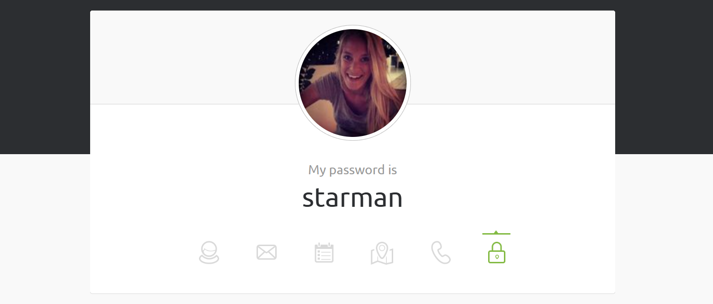

# 🎯 Objetivo

Criar um site não tão simples e **responsivo** que mostra dados de usuários vindos de uma API real, utilizando boas práticas de TypeScript, animações CSS e layout moderno.

---

## 📄 Descrição do Projeto

Você irá criar uma página que busca e exibe usuários aleatórios da API [randomuser.me](https://randomuser.me/), com animações de entrada, transições suaves e layout responsivo (mobile first).

Sua pagina deverá ter um favicon bem legal!

Esse mini projeto deve ter duas paginas. Uma pagina inicial com uma mensagem de boas vindas. E exibir os dados de um usuario como no exemplo da API:


Essa pagina devera ter tambem um botao, em a cada clique ela deverá mostrar mais 1 card com mais um usuario e cada vez que o usuário clicar no botão um novo card devera aparecer logo abaixo.

Você deverá adicionar a segunda pagina uma chamada que mostre diretamente 20 usuarios, ou seja 20 cards.

---

## 🧩 Requisitos Técnicos

- **TypeScript**
  - Criar uma interface `User` com os campos necessários (uma só interface me parece pouco)
  - Escrever uma função `fetchUsers(count: number): Promise<User[]>` que faz o fetch e retorna os dados tipados.
  - As funções devem ser testadas (unit tests).

- **HTML + CSS**
  - Exibir os usuários em cards com nome, foto e email.
  - Adicionar **pelo menos uma animação com `@keyframes`** para entrada dos cards.
  - Adicionar **pelo menos uma `transition`** (ex: hover nos cards).
  - O layout deve ser feito usando **CSS Grid ou Flexbox**.
  - A página deve ser **responsiva e mobile first**:
    - 1 coluna no celular
    - 2 colunas no tablet
    - 3 colunas no desktop

- **Web API**
   -  Salve os dados do usuario no localStorage ou no sessionStorage, caso o usuario saia da pagina ou do site os dados dele sejam mantidos localmente.


- **Estrutura sugerida:**
  ```
  root/
    index.html
    style.css
    main.tsx
    /interfaces
    /types
    /enums
    /services
    /tests
    /components
  ```

- **Responsividade:** O site deve se adaptar a diferentes tamanhos de tela.

---

## ✅ Bônus

- Botão "Carregar mais usuários" que faz novo fetch.
- Transição de cor ou opacidade nos hovers dos cards.

---

## 💻 Comandos Úteis

- **Compilar o projeto:**
  ```sh
  tsc
  ```

- **Rodar o projeto compilado (abrir no navegador) (ou usar o go live, mais facil):** 
  ```sh
  npx serve .
  ```
  *(ou abra o `index.html` diretamente no navegador)*

- **Rodar os testes:**
  ```sh
  npm jest ./
  ```

  - **Criar um tsconfig com CLI:**
  ```sh
  npx tsc --init
  ```

---

## ✔️ Checklist

- [ ] Estrutura de pastas criada
- [ ] Criação do .tsconfig
- [ ] Interface `User` implementada
- [ ] Função `fetchUsers` criada e testada
- [ ] Cards com animação de entrada e transição no hover
- [ ] Layout com Grid ou Flexbox
- [ ] Responsividade (mobile first)
- [ ] Projeto compilado e rodando